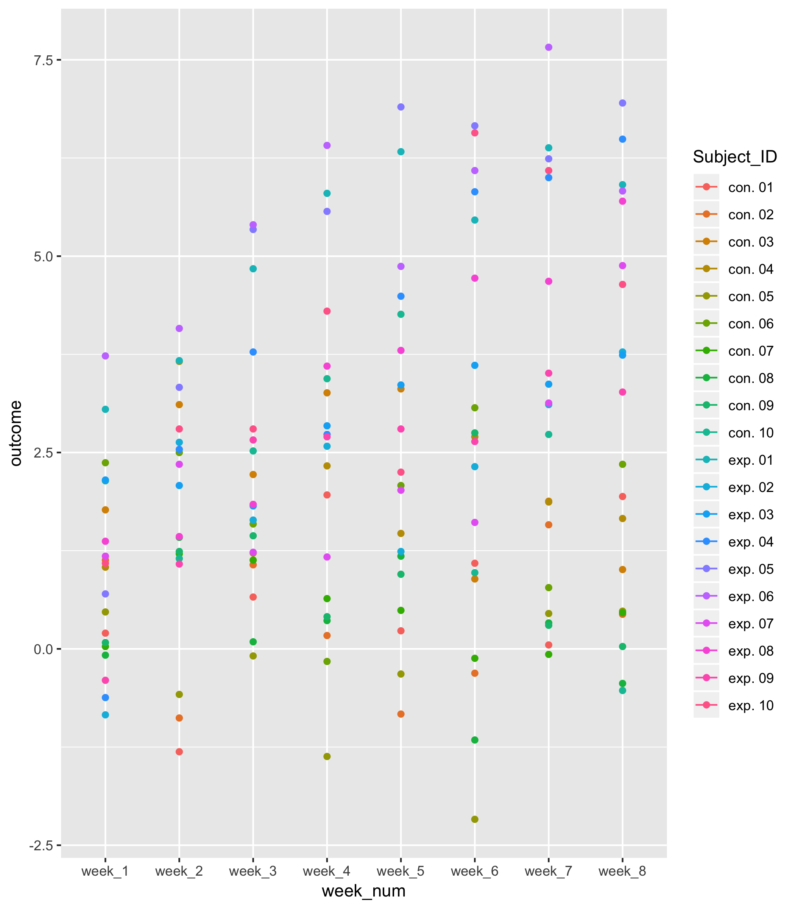
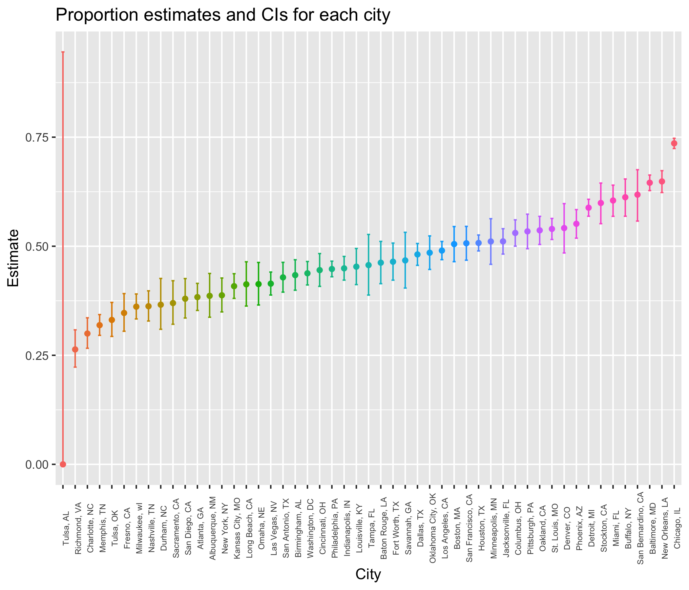

p8105\_hw5\_mm5354
================
Mengran Ma
2018/11/1

Problem 1
=========

**My words: Initially this dataset is a folder that contains data from a longitudinal research study that includes a control arm and an experimental arm. Data for each participant is included in a separate csv file, and file names include the subject ID and the arm this subject belongs to. What we want to do is to combine separate csv files together, in order to create a whole dataset which contains: each participant's outcomes/measurements from week 1 to week 8, along with which group (control vs. experimental) this participant is belonging to, and finally each participant's individual subject ID.**

Start with a dataframe containing all file names; Iterate over file names and read in data for each subject using purrr::map and saving the result as a new variable in the dataframe

``` r
csv_load_and_tidy = function(path) {
  
  df = read_csv(path) %>%
    janitor::clean_names()
  
  df
  
}

setwd("/Users/nadongma/Desktop/p8105_hw5_mm5354/data")

list_of_csvs =  data.frame(list.files()) %>% 
  separate(list.files.., into = c("control_arm", "subject_ID"), sep = "_")

list_of_csvs = list_of_csvs %>% 
  separate(subject_ID, into = c("Subject_ID"), sep = ".csv") %>% 
  mutate(path = list.files())

output_csvs = map(list_of_csvs$path, csv_load_and_tidy) %>% 
  bind_rows()
```

Tidy the result; manipulate file names to include control arm and subject ID, make sure weekly observations are “tidy”, and do any other tidying that’s necessary

``` r
output_csvs = cbind(output_csvs, list_of_csvs) %>%
  select(-path) %>% 
  unite(Subject_ID, control_arm, Subject_ID, sep = ". ", remove = FALSE) %>% 
  gather(key = week_num, value = outcome, week_1:week_8) 
```

Make a spaghetti plot showing observations on each subject over time, and comment on differences between groups.

``` r
output_csvs %>%
  ggplot(aes(x = week_num, y = outcome, color = Subject_ID, group = Subject_ID)) + 
    geom_point() + 
    geom_line() + 
    facet_grid(~control_arm) +
    theme(axis.text.x = element_text(angle = 45, size = 6)) +
    theme(legend.position = "bottom") +
    labs(
      title = "Spaghetti plot showing observations on each subject over time",
      x = "Week Number",
      y = "Outcome for each subject"
      ) 
```

 **My Comment: The overall trend of observations/outcomes in control group remains roughly the same or slightly decreases across time, while in contrast, the trend of observations of in experimental group increases as time (weeks) go by. Though the flutuation of each subject whithin each group varies between individuals, the overall trend for each of 2 groups is obvious as the plots have gaven.**

Problem 2
=========

**My Words: The Washington Post has collected data on homicides across 50 large cities in the U.S. This dataset contains 12 variables/columns: uid, reported\_date, victim's last name, victim's first name, victim's race, victim's age, victim's sex, city, state, latitude, longitude, and disposition. There are a total of 788 rows, meaning 788 victims, with each row represents each individual victim.**

Read and clean the data. Create a city\_state variable (e.g. “Baltimore, MD”) and then summarize within cities to obtain the total number of homicides and the number of unsolved homicides (those for which the disposition is “Closed without arrest” or “Open/No arrest”).

``` r
tidy_data = 
  read_csv("/Users/nadongma/Desktop/p8105_hw5_mm5354/homicide_data.csv") %>% 
  janitor::clean_names() %>% 
  unite(city_state, city, state, sep = ", ", remove = FALSE)
```

    ## Parsed with column specification:
    ## cols(
    ##   uid = col_character(),
    ##   reported_date = col_integer(),
    ##   victim_last = col_character(),
    ##   victim_first = col_character(),
    ##   victim_race = col_character(),
    ##   victim_age = col_character(),
    ##   victim_sex = col_character(),
    ##   city = col_character(),
    ##   state = col_character(),
    ##   lat = col_double(),
    ##   lon = col_double(),
    ##   disposition = col_character()
    ## )

``` r
total_number_homicides = tidy_data %>% 
  group_by(city_state) %>%
  summarize(total_num_homicides = n())

number_unsolved_homicides = tidy_data %>%
  filter(disposition == "Closed without arrest" | disposition == "Open/No arrest") %>%
  group_by(city_state) %>%
  summarize(num_unsolved_homicides = n()) 
  
proportion_test_data = left_join(total_number_homicides, number_unsolved_homicides) 
```

    ## Joining, by = "city_state"

``` r
proportion_test_data[is.na(proportion_test_data)] <- 0

proportion_test_data
```

    ## # A tibble: 51 x 3
    ##    city_state      total_num_homicides num_unsolved_homicides
    ##    <chr>                         <int>                  <dbl>
    ##  1 Albuquerque, NM                 378                    146
    ##  2 Atlanta, GA                     973                    373
    ##  3 Baltimore, MD                  2827                   1825
    ##  4 Baton Rouge, LA                 424                    196
    ##  5 Birmingham, AL                  800                    347
    ##  6 Boston, MA                      614                    310
    ##  7 Buffalo, NY                     521                    319
    ##  8 Charlotte, NC                   687                    206
    ##  9 Chicago, IL                    5535                   4073
    ## 10 Cincinnati, OH                  694                    309
    ## # ... with 41 more rows

For the city of Baltimore, MD, use the prop.test function to estimate the proportion of homicides that are unsolved; save the output of prop.test as an R object, apply the broom::tidy to this object and pull the estimated proportion and confidence intervals from the resulting tidy dataframe.

``` r
Baltimore_proportion_test = broom::tidy(prop.test(proportion_test_data$num_unsolved_homicides[proportion_test_data$city_state == "Baltimore, MD"],proportion_test_data$total_num_homicides[proportion_test_data$city_state == "Baltimore, MD"], conf.level = 0.95, correct = TRUE))

Baltimore_proportion_test
```

    ## # A tibble: 1 x 8
    ##   estimate statistic  p.value parameter conf.low conf.high method
    ##      <dbl>     <dbl>    <dbl>     <int>    <dbl>     <dbl> <chr> 
    ## 1    0.646      239. 6.46e-54         1    0.628     0.663 1-sam…
    ## # ... with 1 more variable: alternative <chr>

Using the prop.test function to estimate the proportion of homicides that are unsolved: **estimated proportion = 0.6455607, confidence interval = (0.6275625 , 0.6631599).**

Now run prop.test for each of the cities in your dataset, and extract both the proportion of unsolved homicides and the confidence interval for each. Do this within a “tidy” pipeline, making use of purrr::map, purrr::map2, list columns and unnest as necessary to create a tidy dataframe with estimated proportions and CIs for each city.

``` r
proportion_test_output = map2(.x = proportion_test_data$num_unsolved_homicides, .y = proportion_test_data$total_num_homicides, ~prop.test(.x, .y))
```

    ## Warning in prop.test(.x, .y): Chi-squared approximation may be incorrect

``` r
proportion_test_output = map_df(.x = proportion_test_output, ~broom::tidy(.x)) %>%
  mutate(city_state = proportion_test_data$city_state) %>%
  select(estimate, conf.low, conf.high, city_state)

proportion_test_output
```

    ## # A tibble: 51 x 4
    ##    estimate conf.low conf.high city_state     
    ##       <dbl>    <dbl>     <dbl> <chr>          
    ##  1    0.386    0.337     0.438 Albuquerque, NM
    ##  2    0.383    0.353     0.415 Atlanta, GA    
    ##  3    0.646    0.628     0.663 Baltimore, MD  
    ##  4    0.462    0.414     0.511 Baton Rouge, LA
    ##  5    0.434    0.399     0.469 Birmingham, AL 
    ##  6    0.505    0.465     0.545 Boston, MA     
    ##  7    0.612    0.569     0.654 Buffalo, NY    
    ##  8    0.300    0.266     0.336 Charlotte, NC  
    ##  9    0.736    0.724     0.747 Chicago, IL    
    ## 10    0.445    0.408     0.483 Cincinnati, OH 
    ## # ... with 41 more rows

Create a plot that shows the estimates and CIs for each city. Organize cities according to the proportion of unsolved homicides.

``` r
proportion_test_output %>% 
  mutate(city_state = fct_reorder(city_state, estimate)) %>%
  ggplot(aes(x = city_state, y = estimate, color = city_state)) +
  geom_point() +
  geom_errorbar(aes(ymin = conf.low , ymax = conf.high), width = 0.25) +
  labs(
      title = "Proportion estimates and CIs for each city",
      x = "City",
      y = "Estimate"
      ) +
  theme(axis.text.x = element_text(angle = 90, size = 6)) +
  theme(legend.position = "none")
```


