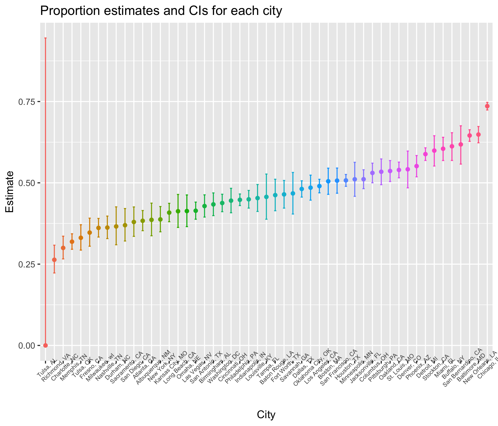

p8105\_hw5\_mm5354
================
Mengran Ma
2018/11/1

``` r
csv_load_and_tidy = function(path) {
  
  df = read_csv(path) %>%
    janitor::clean_names()
  
  df
  
}

setwd("/Users/nadongma/Desktop/p8105_hw5_mm5354/data")

list_of_csvs =  data.frame(list.files()) %>% 
  separate(list.files.., into = c("group", "subject_ID"), sep = "_")

list_of_csvs = list_of_csvs %>% 
  separate(subject_ID, into = c("Subject_ID"), sep = ".csv") %>% 
  mutate(path = list.files())
```

    ## Warning: Expected 1 pieces. Additional pieces discarded in 20 rows [1, 2,
    ## 3, 4, 5, 6, 7, 8, 9, 10, 11, 12, 13, 14, 15, 16, 17, 18, 19, 20].

``` r
output_csvs = map(list_of_csvs$path, csv_load_and_tidy) %>% 
  bind_rows()
```

    ## Parsed with column specification:
    ## cols(
    ##   week_1 = col_double(),
    ##   week_2 = col_double(),
    ##   week_3 = col_double(),
    ##   week_4 = col_double(),
    ##   week_5 = col_double(),
    ##   week_6 = col_double(),
    ##   week_7 = col_double(),
    ##   week_8 = col_double()
    ## )
    ## Parsed with column specification:
    ## cols(
    ##   week_1 = col_double(),
    ##   week_2 = col_double(),
    ##   week_3 = col_double(),
    ##   week_4 = col_double(),
    ##   week_5 = col_double(),
    ##   week_6 = col_double(),
    ##   week_7 = col_double(),
    ##   week_8 = col_double()
    ## )
    ## Parsed with column specification:
    ## cols(
    ##   week_1 = col_double(),
    ##   week_2 = col_double(),
    ##   week_3 = col_double(),
    ##   week_4 = col_double(),
    ##   week_5 = col_double(),
    ##   week_6 = col_double(),
    ##   week_7 = col_double(),
    ##   week_8 = col_double()
    ## )
    ## Parsed with column specification:
    ## cols(
    ##   week_1 = col_double(),
    ##   week_2 = col_double(),
    ##   week_3 = col_double(),
    ##   week_4 = col_double(),
    ##   week_5 = col_double(),
    ##   week_6 = col_double(),
    ##   week_7 = col_double(),
    ##   week_8 = col_double()
    ## )
    ## Parsed with column specification:
    ## cols(
    ##   week_1 = col_double(),
    ##   week_2 = col_double(),
    ##   week_3 = col_double(),
    ##   week_4 = col_double(),
    ##   week_5 = col_double(),
    ##   week_6 = col_double(),
    ##   week_7 = col_double(),
    ##   week_8 = col_double()
    ## )
    ## Parsed with column specification:
    ## cols(
    ##   week_1 = col_double(),
    ##   week_2 = col_double(),
    ##   week_3 = col_double(),
    ##   week_4 = col_double(),
    ##   week_5 = col_double(),
    ##   week_6 = col_double(),
    ##   week_7 = col_double(),
    ##   week_8 = col_double()
    ## )
    ## Parsed with column specification:
    ## cols(
    ##   week_1 = col_double(),
    ##   week_2 = col_double(),
    ##   week_3 = col_double(),
    ##   week_4 = col_double(),
    ##   week_5 = col_double(),
    ##   week_6 = col_double(),
    ##   week_7 = col_double(),
    ##   week_8 = col_double()
    ## )
    ## Parsed with column specification:
    ## cols(
    ##   week_1 = col_double(),
    ##   week_2 = col_double(),
    ##   week_3 = col_double(),
    ##   week_4 = col_double(),
    ##   week_5 = col_double(),
    ##   week_6 = col_double(),
    ##   week_7 = col_double(),
    ##   week_8 = col_double()
    ## )
    ## Parsed with column specification:
    ## cols(
    ##   week_1 = col_double(),
    ##   week_2 = col_double(),
    ##   week_3 = col_double(),
    ##   week_4 = col_double(),
    ##   week_5 = col_double(),
    ##   week_6 = col_double(),
    ##   week_7 = col_double(),
    ##   week_8 = col_double()
    ## )
    ## Parsed with column specification:
    ## cols(
    ##   week_1 = col_double(),
    ##   week_2 = col_double(),
    ##   week_3 = col_double(),
    ##   week_4 = col_double(),
    ##   week_5 = col_double(),
    ##   week_6 = col_double(),
    ##   week_7 = col_double(),
    ##   week_8 = col_double()
    ## )
    ## Parsed with column specification:
    ## cols(
    ##   week_1 = col_double(),
    ##   week_2 = col_double(),
    ##   week_3 = col_double(),
    ##   week_4 = col_double(),
    ##   week_5 = col_double(),
    ##   week_6 = col_double(),
    ##   week_7 = col_double(),
    ##   week_8 = col_double()
    ## )
    ## Parsed with column specification:
    ## cols(
    ##   week_1 = col_double(),
    ##   week_2 = col_double(),
    ##   week_3 = col_double(),
    ##   week_4 = col_double(),
    ##   week_5 = col_double(),
    ##   week_6 = col_double(),
    ##   week_7 = col_double(),
    ##   week_8 = col_double()
    ## )
    ## Parsed with column specification:
    ## cols(
    ##   week_1 = col_double(),
    ##   week_2 = col_double(),
    ##   week_3 = col_double(),
    ##   week_4 = col_double(),
    ##   week_5 = col_double(),
    ##   week_6 = col_double(),
    ##   week_7 = col_double(),
    ##   week_8 = col_double()
    ## )

    ## Parsed with column specification:
    ## cols(
    ##   week_1 = col_double(),
    ##   week_2 = col_double(),
    ##   week_3 = col_double(),
    ##   week_4 = col_double(),
    ##   week_5 = col_double(),
    ##   week_6 = col_double(),
    ##   week_7 = col_integer(),
    ##   week_8 = col_double()
    ## )

    ## Parsed with column specification:
    ## cols(
    ##   week_1 = col_double(),
    ##   week_2 = col_double(),
    ##   week_3 = col_double(),
    ##   week_4 = col_double(),
    ##   week_5 = col_double(),
    ##   week_6 = col_double(),
    ##   week_7 = col_double(),
    ##   week_8 = col_double()
    ## )
    ## Parsed with column specification:
    ## cols(
    ##   week_1 = col_double(),
    ##   week_2 = col_double(),
    ##   week_3 = col_double(),
    ##   week_4 = col_double(),
    ##   week_5 = col_double(),
    ##   week_6 = col_double(),
    ##   week_7 = col_double(),
    ##   week_8 = col_double()
    ## )
    ## Parsed with column specification:
    ## cols(
    ##   week_1 = col_double(),
    ##   week_2 = col_double(),
    ##   week_3 = col_double(),
    ##   week_4 = col_double(),
    ##   week_5 = col_double(),
    ##   week_6 = col_double(),
    ##   week_7 = col_double(),
    ##   week_8 = col_double()
    ## )
    ## Parsed with column specification:
    ## cols(
    ##   week_1 = col_double(),
    ##   week_2 = col_double(),
    ##   week_3 = col_double(),
    ##   week_4 = col_double(),
    ##   week_5 = col_double(),
    ##   week_6 = col_double(),
    ##   week_7 = col_double(),
    ##   week_8 = col_double()
    ## )
    ## Parsed with column specification:
    ## cols(
    ##   week_1 = col_double(),
    ##   week_2 = col_double(),
    ##   week_3 = col_double(),
    ##   week_4 = col_double(),
    ##   week_5 = col_double(),
    ##   week_6 = col_double(),
    ##   week_7 = col_double(),
    ##   week_8 = col_double()
    ## )
    ## Parsed with column specification:
    ## cols(
    ##   week_1 = col_double(),
    ##   week_2 = col_double(),
    ##   week_3 = col_double(),
    ##   week_4 = col_double(),
    ##   week_5 = col_double(),
    ##   week_6 = col_double(),
    ##   week_7 = col_double(),
    ##   week_8 = col_double()
    ## )

``` r
output_csvs = cbind(output_csvs, list_of_csvs) %>% 
  select(-path) %>% 
  unite(Subject_ID, group, Subject_ID, sep = ". ", remove = FALSE)
```

``` r
output_csvs %>%
  gather(key = week_num, value = outcome, week_1:week_8) %>% 
  ggplot(aes(x = week_num, y = outcome, color = Subject_ID)) + 
    geom_point() + geom_line()
```

    ## geom_path: Each group consists of only one observation. Do you need to
    ## adjust the group aesthetic?


Problem 2
=========

##### Read and clean the data

``` r
tidy_data = 
  read_csv("/Users/nadongma/Desktop/p8105_hw5_mm5354/homicide_data.csv") %>% 
  janitor::clean_names() %>% 
  unite(city_state, city, state, sep = ", ", remove = FALSE)
```

    ## Parsed with column specification:
    ## cols(
    ##   uid = col_character(),
    ##   reported_date = col_integer(),
    ##   victim_last = col_character(),
    ##   victim_first = col_character(),
    ##   victim_race = col_character(),
    ##   victim_age = col_character(),
    ##   victim_sex = col_character(),
    ##   city = col_character(),
    ##   state = col_character(),
    ##   lat = col_double(),
    ##   lon = col_double(),
    ##   disposition = col_character()
    ## )

``` r
total_number_homicides = tidy_data %>% 
  group_by(city) %>%
  summarize(total_num_homicides = n())

number_unsolved_homicides = tidy_data %>%
  filter(disposition == "Closed without arrest" | disposition == "Open/No arrest") %>%
  group_by(city) %>%
  summarize(num_unsolved_homicides = n())
  
proportion_test_data = left_join(total_number_homicides, number_unsolved_homicides)
```

    ## Joining, by = "city"

``` r
#broom::tidy(map2(.x = proportion_test_data$num_unsolved_homicides[1:50], .n = proportion_test_data$total_num_homicides[1:50], .f = prop.test(x = .x, n = .n)))

output_proportion_test = vector("list", length = 50)

for (i in 1:50) {
  output_proportion_test[[i]] = broom::tidy(prop.test(proportion_test_data$num_unsolved_homicides[i],proportion_test_data$total_num_homicides[i]))
}

#proportion_test_data = tibble(cbind(proportion_test_data$city, bind_rows(output_proportion_test)[1:6]))

output_proportion_test = bind_rows(output_proportion_test) %>% 
  mutate(city = proportion_test_data$city) %>%
  select(-method, -alternative)
```

Create a plot that shows the estimates and CIs for each city. Organize cities according to the proportion of unsolved homicides.

``` r
output_proportion_test %>% 
  mutate(city = fct_reorder(city, estimate)) %>%
  ggplot(aes(x = city, y = estimate, color = city)) +
  geom_point() +
  geom_errorbar(aes(ymin = conf.low , ymax = conf.high), width = 0.25) +
  labs(
      title = "Proportion estimates and CIs for each city",
      x = "City",
      y = "Estimate"
      ) +
  theme(axis.text.x = element_text(angle = 45, size = 6)) +
  theme(legend.position = "none")
```



For the city of Baltimore, MD, use the prop.test function to estimate the proportion of homicides that are unsolved; save the output of prop.test as an R object, apply the broom::tidy to this object and pull the estimated proportion and confidence intervals from the resulting tidy dataframe.

``` r
Baltimore_proportion_test = broom::tidy(prop.test(number_unsolved_homicides$num_unsolved_homicides[number_unsolved_homicides$city == "Baltimore"],total_number_homicides$total_num_homicides[total_number_homicides$city == "Baltimore"], conf.level = 0.95, correct = TRUE))
```

Using the prop.test function to estimate the proportion of homicides that are unsolved: **estimated proportion = 0.6455607, confidence interval = (0.6275625 , 0.6631599).**

``` r
broom::tidy(prop.test(number_unsolved_homicides$num_unsolved_homicides,total_number_homicides$total_num_homicides, conf.level = 0.95, correct = TRUE))
```

    ## # A tibble: 1 x 55
    ##   estimate1 estimate2 estimate3 estimate4 estimate5 estimate6 estimate7
    ##       <dbl>     <dbl>     <dbl>     <dbl>     <dbl>     <dbl>     <dbl>
    ## 1     0.386     0.383     0.646     0.462     0.434     0.505     0.612
    ## # ... with 48 more variables: estimate8 <dbl>, estimate9 <dbl>,
    ## #   estimate10 <dbl>, estimate11 <dbl>, estimate12 <dbl>,
    ## #   estimate13 <dbl>, estimate14 <dbl>, estimate15 <dbl>,
    ## #   estimate16 <dbl>, estimate17 <dbl>, estimate18 <dbl>,
    ## #   estimate19 <dbl>, estimate20 <dbl>, estimate21 <dbl>,
    ## #   estimate22 <dbl>, estimate23 <dbl>, estimate24 <dbl>,
    ## #   estimate25 <dbl>, estimate26 <dbl>, estimate27 <dbl>,
    ## #   estimate28 <dbl>, estimate29 <dbl>, estimate30 <dbl>,
    ## #   estimate31 <dbl>, estimate32 <dbl>, estimate33 <dbl>,
    ## #   estimate34 <dbl>, estimate35 <dbl>, estimate36 <dbl>,
    ## #   estimate37 <dbl>, estimate38 <dbl>, estimate39 <dbl>,
    ## #   estimate40 <dbl>, estimate41 <dbl>, estimate42 <dbl>,
    ## #   estimate43 <dbl>, estimate44 <dbl>, estimate45 <dbl>,
    ## #   estimate46 <dbl>, estimate47 <dbl>, estimate48 <dbl>,
    ## #   estimate49 <dbl>, estimate50 <dbl>, statistic <dbl>, p.value <dbl>,
    ## #   parameter <dbl>, method <chr>, alternative <chr>
