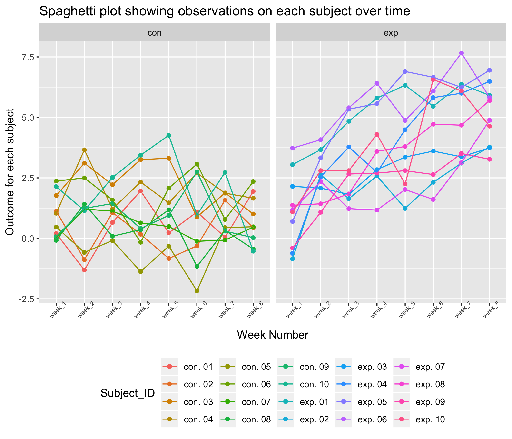

p8105\_hw5\_mm5354
================
Mengran Ma
2018/11/1

``` r
csv_load_and_tidy = function(path) {
  
  df = read_csv(path) %>%
    janitor::clean_names()
  
  df
  
}

setwd("/Users/nadongma/Desktop/p8105_hw5_mm5354/data")

list_of_csvs =  data.frame(list.files()) %>% 
  separate(list.files.., into = c("control_arm", "subject_ID"), sep = "_")

list_of_csvs = list_of_csvs %>% 
  separate(subject_ID, into = c("Subject_ID"), sep = ".csv") %>% 
  mutate(path = list.files())
```

    ## Warning: Expected 1 pieces. Additional pieces discarded in 20 rows [1, 2,
    ## 3, 4, 5, 6, 7, 8, 9, 10, 11, 12, 13, 14, 15, 16, 17, 18, 19, 20].

``` r
output_csvs = map(list_of_csvs$path, csv_load_and_tidy) %>% 
  bind_rows()
```

    ## Parsed with column specification:
    ## cols(
    ##   week_1 = col_double(),
    ##   week_2 = col_double(),
    ##   week_3 = col_double(),
    ##   week_4 = col_double(),
    ##   week_5 = col_double(),
    ##   week_6 = col_double(),
    ##   week_7 = col_double(),
    ##   week_8 = col_double()
    ## )
    ## Parsed with column specification:
    ## cols(
    ##   week_1 = col_double(),
    ##   week_2 = col_double(),
    ##   week_3 = col_double(),
    ##   week_4 = col_double(),
    ##   week_5 = col_double(),
    ##   week_6 = col_double(),
    ##   week_7 = col_double(),
    ##   week_8 = col_double()
    ## )
    ## Parsed with column specification:
    ## cols(
    ##   week_1 = col_double(),
    ##   week_2 = col_double(),
    ##   week_3 = col_double(),
    ##   week_4 = col_double(),
    ##   week_5 = col_double(),
    ##   week_6 = col_double(),
    ##   week_7 = col_double(),
    ##   week_8 = col_double()
    ## )
    ## Parsed with column specification:
    ## cols(
    ##   week_1 = col_double(),
    ##   week_2 = col_double(),
    ##   week_3 = col_double(),
    ##   week_4 = col_double(),
    ##   week_5 = col_double(),
    ##   week_6 = col_double(),
    ##   week_7 = col_double(),
    ##   week_8 = col_double()
    ## )
    ## Parsed with column specification:
    ## cols(
    ##   week_1 = col_double(),
    ##   week_2 = col_double(),
    ##   week_3 = col_double(),
    ##   week_4 = col_double(),
    ##   week_5 = col_double(),
    ##   week_6 = col_double(),
    ##   week_7 = col_double(),
    ##   week_8 = col_double()
    ## )
    ## Parsed with column specification:
    ## cols(
    ##   week_1 = col_double(),
    ##   week_2 = col_double(),
    ##   week_3 = col_double(),
    ##   week_4 = col_double(),
    ##   week_5 = col_double(),
    ##   week_6 = col_double(),
    ##   week_7 = col_double(),
    ##   week_8 = col_double()
    ## )
    ## Parsed with column specification:
    ## cols(
    ##   week_1 = col_double(),
    ##   week_2 = col_double(),
    ##   week_3 = col_double(),
    ##   week_4 = col_double(),
    ##   week_5 = col_double(),
    ##   week_6 = col_double(),
    ##   week_7 = col_double(),
    ##   week_8 = col_double()
    ## )
    ## Parsed with column specification:
    ## cols(
    ##   week_1 = col_double(),
    ##   week_2 = col_double(),
    ##   week_3 = col_double(),
    ##   week_4 = col_double(),
    ##   week_5 = col_double(),
    ##   week_6 = col_double(),
    ##   week_7 = col_double(),
    ##   week_8 = col_double()
    ## )
    ## Parsed with column specification:
    ## cols(
    ##   week_1 = col_double(),
    ##   week_2 = col_double(),
    ##   week_3 = col_double(),
    ##   week_4 = col_double(),
    ##   week_5 = col_double(),
    ##   week_6 = col_double(),
    ##   week_7 = col_double(),
    ##   week_8 = col_double()
    ## )
    ## Parsed with column specification:
    ## cols(
    ##   week_1 = col_double(),
    ##   week_2 = col_double(),
    ##   week_3 = col_double(),
    ##   week_4 = col_double(),
    ##   week_5 = col_double(),
    ##   week_6 = col_double(),
    ##   week_7 = col_double(),
    ##   week_8 = col_double()
    ## )
    ## Parsed with column specification:
    ## cols(
    ##   week_1 = col_double(),
    ##   week_2 = col_double(),
    ##   week_3 = col_double(),
    ##   week_4 = col_double(),
    ##   week_5 = col_double(),
    ##   week_6 = col_double(),
    ##   week_7 = col_double(),
    ##   week_8 = col_double()
    ## )
    ## Parsed with column specification:
    ## cols(
    ##   week_1 = col_double(),
    ##   week_2 = col_double(),
    ##   week_3 = col_double(),
    ##   week_4 = col_double(),
    ##   week_5 = col_double(),
    ##   week_6 = col_double(),
    ##   week_7 = col_double(),
    ##   week_8 = col_double()
    ## )
    ## Parsed with column specification:
    ## cols(
    ##   week_1 = col_double(),
    ##   week_2 = col_double(),
    ##   week_3 = col_double(),
    ##   week_4 = col_double(),
    ##   week_5 = col_double(),
    ##   week_6 = col_double(),
    ##   week_7 = col_double(),
    ##   week_8 = col_double()
    ## )

    ## Parsed with column specification:
    ## cols(
    ##   week_1 = col_double(),
    ##   week_2 = col_double(),
    ##   week_3 = col_double(),
    ##   week_4 = col_double(),
    ##   week_5 = col_double(),
    ##   week_6 = col_double(),
    ##   week_7 = col_integer(),
    ##   week_8 = col_double()
    ## )

    ## Parsed with column specification:
    ## cols(
    ##   week_1 = col_double(),
    ##   week_2 = col_double(),
    ##   week_3 = col_double(),
    ##   week_4 = col_double(),
    ##   week_5 = col_double(),
    ##   week_6 = col_double(),
    ##   week_7 = col_double(),
    ##   week_8 = col_double()
    ## )
    ## Parsed with column specification:
    ## cols(
    ##   week_1 = col_double(),
    ##   week_2 = col_double(),
    ##   week_3 = col_double(),
    ##   week_4 = col_double(),
    ##   week_5 = col_double(),
    ##   week_6 = col_double(),
    ##   week_7 = col_double(),
    ##   week_8 = col_double()
    ## )
    ## Parsed with column specification:
    ## cols(
    ##   week_1 = col_double(),
    ##   week_2 = col_double(),
    ##   week_3 = col_double(),
    ##   week_4 = col_double(),
    ##   week_5 = col_double(),
    ##   week_6 = col_double(),
    ##   week_7 = col_double(),
    ##   week_8 = col_double()
    ## )
    ## Parsed with column specification:
    ## cols(
    ##   week_1 = col_double(),
    ##   week_2 = col_double(),
    ##   week_3 = col_double(),
    ##   week_4 = col_double(),
    ##   week_5 = col_double(),
    ##   week_6 = col_double(),
    ##   week_7 = col_double(),
    ##   week_8 = col_double()
    ## )
    ## Parsed with column specification:
    ## cols(
    ##   week_1 = col_double(),
    ##   week_2 = col_double(),
    ##   week_3 = col_double(),
    ##   week_4 = col_double(),
    ##   week_5 = col_double(),
    ##   week_6 = col_double(),
    ##   week_7 = col_double(),
    ##   week_8 = col_double()
    ## )
    ## Parsed with column specification:
    ## cols(
    ##   week_1 = col_double(),
    ##   week_2 = col_double(),
    ##   week_3 = col_double(),
    ##   week_4 = col_double(),
    ##   week_5 = col_double(),
    ##   week_6 = col_double(),
    ##   week_7 = col_double(),
    ##   week_8 = col_double()
    ## )

``` r
output_csvs = cbind(output_csvs, list_of_csvs) %>% 
  select(-path) %>% 
  unite(Subject_ID, control_arm, Subject_ID, sep = ". ", remove = FALSE)
```

``` r
output_csvs %>%
  gather(key = week_num, value = outcome, week_1:week_8) %>% 
  ggplot(aes(x = week_num, y = outcome, color = Subject_ID, group = Subject_ID)) + 
    geom_point() + 
    geom_line() + 
    facet_grid(~control_arm) +
    theme(axis.text.x = element_text(angle = 45, size = 6)) +
    theme(legend.position = "bottom") +
    labs(
      title = "Spaghetti plot showing observations on each subject over time",
      x = "Week Number",
      y = "Outcome for each subject"
      ) 
```



Problem 2
=========

##### Read and clean the data

``` r
tidy_data = 
  read_csv("/Users/nadongma/Desktop/p8105_hw5_mm5354/homicide_data.csv") %>% 
  janitor::clean_names() %>% 
  unite(city_state, city, state, sep = ", ", remove = FALSE)
```

    ## Parsed with column specification:
    ## cols(
    ##   uid = col_character(),
    ##   reported_date = col_integer(),
    ##   victim_last = col_character(),
    ##   victim_first = col_character(),
    ##   victim_race = col_character(),
    ##   victim_age = col_character(),
    ##   victim_sex = col_character(),
    ##   city = col_character(),
    ##   state = col_character(),
    ##   lat = col_double(),
    ##   lon = col_double(),
    ##   disposition = col_character()
    ## )

``` r
total_number_homicides = tidy_data %>% 
  group_by(city_state) %>%
  summarize(total_num_homicides = n())

number_unsolved_homicides = tidy_data %>%
  filter(disposition == "Closed without arrest" | disposition == "Open/No arrest") %>%
  group_by(city_state) %>%
  summarize(num_unsolved_homicides = n()) 
  
proportion_test_data = left_join(total_number_homicides, number_unsolved_homicides) 
```

    ## Joining, by = "city_state"

``` r
proportion_test_data[is.na(proportion_test_data)] <- 0

proportion_test_output = map2(.x = proportion_test_data$num_unsolved_homicides, .y = proportion_test_data$total_num_homicides, ~prop.test(.x, .y))
```

    ## Warning in prop.test(.x, .y): Chi-squared approximation may be incorrect

``` r
proportion_test_output = map_df(.x = proportion_test_output, ~broom::tidy(.x)) %>%
  mutate(city_state = proportion_test_data$city_state) %>%
  select(-method, -alternative)
```

Create a plot that shows the estimates and CIs for each city. Organize cities according to the proportion of unsolved homicides.

``` r
proportion_test_output %>% 
  mutate(city_state = fct_reorder(city_state, estimate)) %>%
  ggplot(aes(x = city_state, y = estimate, color = city_state)) +
  geom_point() +
  geom_errorbar(aes(ymin = conf.low , ymax = conf.high), width = 0.25) +
  labs(
      title = "Proportion estimates and CIs for each city",
      x = "City",
      y = "Estimate"
      ) +
  theme(axis.text.x = element_text(angle = 45, size = 6)) +
  theme(legend.position = "none")
```


For the city of Baltimore, MD, use the prop.test function to estimate the proportion of homicides that are unsolved; save the output of prop.test as an R object, apply the broom::tidy to this object and pull the estimated proportion and confidence intervals from the resulting tidy dataframe.

``` r
Baltimore_proportion_test = broom::tidy(prop.test(proportion_test_data$num_unsolved_homicides[proportion_test_data$city_state == "Baltimore, MD"],proportion_test_data$total_num_homicides[proportion_test_data$city_state == "Baltimore, MD"], conf.level = 0.95, correct = TRUE))
```

Using the prop.test function to estimate the proportion of homicides that are unsolved: **estimated proportion = 0.6455607, confidence interval = (0.6275625 , 0.6631599).**

``` r
#broom::tidy(prop.test(proportion_test_data$num_unsolved_homicides,proportion_test_data$total_num_homicides, conf.level = 0.95, correct = TRUE))
```
